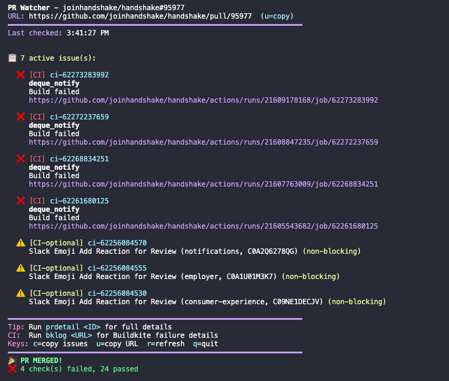

# Cursor PR Watcher

Automatically monitor GitHub PRs for Cursorbot issues and CI (Buildkite/Trunk) failures directly in Cursor. Get notified when issues appear and let your AI agent fix them.

## Features

- **Real-time PR monitoring** - Watch for review bot comments (Cursorbot, Codex) and CI failures
- **Multi-bot support** - Supports Cursorbot (🤖) and ChatGPT Codex (🧠) review bots
- **Buildkite integration** - Fetch failure details via API (works with SSO)
- **Multi-PR support** - Monitor different PRs in different Cursor windows
- **Shell commands** - Push and watch with `gpw`, `gp`, `prwatch`, etc.
- **MCP server** - Use tools in Cursor chat to watch and fix issues
- **macOS notifications** - Get notified when issues appear or PR is ready to merge
- **Clipboard integration** - Fix prompts auto-copied for quick paste into Cursor
- **Cursor rule** - Agents automatically start watcher after push



## Quick Start

### 1. Clone/Copy to your machine

```bash
# Clone or copy to this location:
mkdir -p ~/.cursor/mcp-servers
cd ~/.cursor/mcp-servers
git clone <repo-url> pr-watcher
# Or copy the files manually to ~/.cursor/mcp-servers/pr-watcher/
```

### 2. Install dependencies

```bash
cd ~/.cursor/mcp-servers/pr-watcher
npm install
```

### 3. Configure tokens

```bash
cp .env.example .env
# Edit .env and add your tokens
```

**GitHub Token** (required):
- Create at: https://github.com/settings/tokens
- Scopes needed: `repo` (private repos) or `public_repo` (public repos)

**Buildkite Token** (optional, for CI failure details):
- Create at: https://buildkite.com/user/api-access-tokens
- Permission needed: `read_builds`

### 4. Add shell commands

Add to your `~/.zprofile` (or `~/.zshrc`):

```bash
source ~/.cursor/mcp-servers/pr-watcher/git-push-watch.sh
```

Then reload your shell or run `source ~/.zprofile`.

### 5. (Optional) Install the Cursor Skill

Copy the skill file to your user skills directory:

```bash
mkdir -p ~/.cursor/skills-cursor/pr-watcher
cp ~/.cursor/mcp-servers/pr-watcher/SKILL.md ~/.cursor/skills-cursor/pr-watcher/
```

This teaches Cursor agents how to use the PR watcher automatically.

### 6. (Optional) Install Global Cursor Rule

A global rule makes Cursor agents "PR-aware" - they'll automatically start the watcher after pushes and check for issues:

```bash
mkdir -p ~/.cursor/rules
cp ~/.cursor/mcp-servers/pr-watcher/pr-watcher-awareness.mdc ~/.cursor/rules/
```

Or it may already be installed at `~/.cursor/rules/pr-watcher-awareness.mdc`.

### 7. (Optional) Configure MCP Server

Add to `~/.cursor/mcp.json`:

```json
{
  "mcpServers": {
    "pr-watcher": {
      "command": "node",
      "args": ["~/.cursor/mcp-servers/pr-watcher/index.js"]
    }
  }
}
```

## Usage

### Shell Commands

After sourcing the shell script, these commands are available:

| Command | Description |
|---------|-------------|
| `gpw` | Git push + watch PR in foreground |
| `gpw 8211` | Git push + watch specific PR |
| `gp` | Git push + auto-start background watcher |
| `prwatchfg <PR>` | Watch PR in foreground (no push) |
| `prwatch <PR>` | Watch PR in background |
| `prstatus` | Show all running watchers |
| `prlog` | Tail background watcher log |
| `prstop` | Stop watcher for current PR |
| `prstop --all` | Stop all watchers |
| `prdetail <ID>` | Get full details for an issue |
| `bklog <URL>` | Get Buildkite failure details |

**Watcher keyboard shortcuts** (when terminal is focused):

| Key | Action |
|-----|--------|
| `c` | Copy all issues to clipboard |
| `u` | Copy PR URL to clipboard |
| `r` | Refresh immediately |
| `q` | Quit watcher |

### Example Workflow

```bash
# Make changes, commit, push and watch
gpw

# Output shows:
# PR Watcher - joinhandshake/joinera#8211
# ━━━━━━━━━━━━━━━━━━━━━━━━━━━━━━━━━━━━━━━
# Last checked: 4:30:00 PM
# Keys: c=copy issues  u=copy URL  r=refresh  q=quit
# 
# 📋 3 active issue(s):
#   🤖 [CURSOR] [HIGH] review-123456
#      Missing error handling...
#      src/utils/api.ts:42
#
#   🧠 [CODEX] [P2] review-789012
#      Use a truthy dev base URL...
#      src/utils/getNavBaseUrls.ts:36
# 
#   ❌ [CI] status-789
#      buildkite/handshake
#      Build #494087 failed
#      https://buildkite.com/...
```

When issues appear:
1. A macOS notification shows with the issue summary
2. A fix prompt is automatically copied to your clipboard
3. Open Cursor chat (Cmd+L), paste (Cmd+V), and the agent fixes the issues

**Keyboard shortcuts** (while watcher is running):
- `c` - Copy all issues to clipboard
- `u` - Copy PR URL to clipboard
- `r` - Refresh now (don't wait for poll interval)
- `q` - Quit the watcher

**Ready to merge notification** - When all blocking issues are fixed and CI is green, you'll get a notification with a sound so you know the PR is ready to merge.

**Non-blocking CI failures** - Some CI jobs (Slack notifications, coverage reports, etc.) are marked as non-blocking and won't prevent the "ready to merge" notification. These show as `⚠️ [CI-optional]` in the display.

**Merge queue monitoring** - The watcher tracks merge queue status and notifies you when:
- PR is added to the merge queue
- PR is removed/kicked from the queue (so you can re-add it)
- PR is successfully merged

### Investigating CI Failures

When a Buildkite build fails:

```bash
bklog https://buildkite.com/handshake/handshake/builds/494087
```

This fetches the build details via API and shows:
- Which jobs failed
- Error messages with file paths and line numbers
- Stack traces for test failures

### Multi-PR Monitoring

Watch different PRs in different terminals:

```bash
# Terminal 1 (joinera project)
prwatchfg 8211

# Terminal 2 (handshake project)  
prwatchfg 95721
```

Each terminal shows "Also watching: ..." to list other active watchers.

### Non-Blocking CI Configuration

By default, these CI job patterns are considered non-blocking (won't prevent "ready to merge"):
- `slack` - Slack notifications
- `notification` - Generic notification jobs  
- `emoji` - Emoji reaction jobs
- `add reaction` - Slack reaction jobs
- `coverage` - Coverage reports
- `codecov` - Codecov reporting
- `deque_notify` - Merge queue dequeue notifications
- `dequeue` - Dequeue-related jobs

### CI Investigation Rules

Two Cursor rules are included to ensure thorough investigation of CI failures:

```bash
# CI failure investigation - prevents dismissing code issues as infrastructure
cp ~/.cursor/mcp-servers/pr-watcher/ci-failure-investigation.mdc ~/.cursor/rules/

# TypeScript project references - ensures proper monorepo type checking
cp ~/.cursor/mcp-servers/pr-watcher/typescript-project-references.mdc ~/.cursor/rules/
```

**CI Failure Investigation** teaches agents to:
- Trace dependency chains for TypeScript errors
- Check downstream packages, not just modified files
- Distinguish code issues from infrastructure issues
- Follow a checklist before concluding "not our code"

**TypeScript Project References** teaches agents to:
- Use `tsc -b` instead of `tsc --noEmit` for project references
- Use monorepo tools (NX, Turbo, etc.) for proper cross-package type checking
- Verify types at the source before adding annotations

To add custom non-blocking patterns, set the `NON_BLOCKING_CI` environment variable:

```bash
# In your .env file or shell
NON_BLOCKING_CI="my-optional-check,another-pattern"
```

## Files

| File | Description |
|------|-------------|
| `index.js` | MCP server for Cursor integration |
| `watcher.js` | Terminal-based PR watcher with notifications + clipboard |
| `buildkite.js` | Buildkite API integration for CI failures |
| `detail.js` | Get detailed info for a specific issue |
| `git-push-watch.sh` | Shell commands (gpw, prwatch, etc.) |
| `SKILL.md` | Cursor skill file (teaches agents how to use this) |
| `pr-watcher-awareness.mdc` | Cursor rule for PR-aware agents |
| `ci-failure-investigation.mdc` | Rule for thorough CI failure investigation |
| `typescript-project-references.mdc` | Rule for proper type checking in monorepos |
| `.env` | Your tokens (not committed) |
| `.env.example` | Template for tokens |

## MCP Tools

If using the MCP server, these tools are available in Cursor chat:

| Tool | Description |
|------|-------------|
| `watch_pr` | Start watching a PR |
| `check_for_issues` | Poll for new issues |
| `get_issue_details` | Get details for an issue |
| `mark_issue_handled` | Dismiss an issue |
| `get_watched_pr` | Show current PR info |
| `clear_handled` | Reset dismissed issues |

## Troubleshooting

**"GITHUB_TOKEN not set"**
- Make sure `.env` exists and has your token
- Check the token doesn't have extra whitespace

**"command not found: gpw"**
- Run `source ~/.cursor/mcp-servers/pr-watcher/git-push-watch.sh`
- Or add it to your `~/.zprofile` and restart terminal

**"Buildkite API error: 401"**
- Check your BUILDKITE_TOKEN in `.env`
- Make sure the token has `read_builds` permission

**No issues showing up**
- The watcher filters out resolved/outdated/dismissed issues
- Check if issues exist on the GitHub PR page
- First poll shows debug info about what was found

**"parse error near '>'"**
- Make sure you're using zsh (the script uses zsh-specific features)
- The shebang should be `#!/bin/zsh`

## License

MIT
